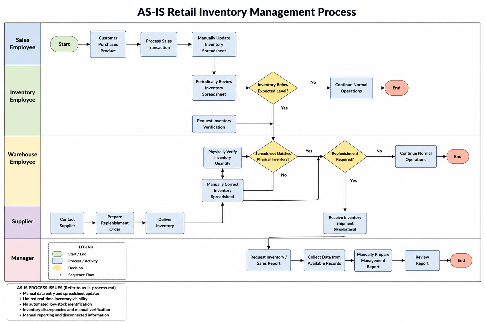

# Retail Inventory Business Systems Analysis

## Project Overview

This project demonstrates an end-to-end business systems analysis for a fictional mid-sized retail organization seeking to replace spreadsheet-based inventory processes with a centralized inventory management and reporting solution.

The project covers business and system requirements, AS-IS and TO-BE process analysis, Agile user stories and acceptance criteria, cost-benefit analysis, SDLC planning, security and operational risk analysis, SQL Server database implementation, User Acceptance Testing (UAT), usability testing, and requirements traceability.

A Power BI management dashboard is planned as the final business intelligence layer of the project.

## Business Problem

The organization currently manages inventory using spreadsheets and disconnected manual processes. Employees manually update inventory levels, verify product availability, track supplier information, and prepare recurring reports.

These processes create several challenges:

- Limited visibility into current inventory levels
- Risk of inventory inaccuracies
- Manual and time-consuming reporting
- Difficulty identifying low-stock products
- Inconsistent transaction tracking
- Limited historical data for business analysis

## AS-IS Process Model

The AS-IS process model documents the organization's current spreadsheet-based inventory workflow and highlights manual activities, process inefficiencies, and opportunities for system improvement.

**Process Modelling Tool:** Microsoft Visio



Detailed AS-IS process documentation is available in [`process-models/as-is-process.md`](process-models/as-is-process.md).

## Proposed Solution

The proposed solution is a centralized retail inventory management system designed to support:

- Product and inventory management
- Supplier management
- Sales transaction tracking
- Automated inventory updates
- Low-stock monitoring
- Historical transaction storage
- Standardized SQL-based reporting
- Management KPI reporting through Power BI

The TO-BE process design replaces manual spreadsheet activities with centralized data, structured transactions, systematic low-stock identification, and standardized reporting.

## Completed Business Systems Analysis Deliverables

- Business requirements
- Functional requirements
- Non-functional requirements
- Requirements mapping
- AS-IS process analysis and process model
- TO-BE process analysis
- UML use-case model
- Cost-benefit and ROI analysis
- Agile user stories
- Acceptance criteria
- SDLC implementation approach
- Security risk assessment
- Security and contingency planning
- SQL Server relational database design
- Executable SQL Server schema
- Sample transactional data
- Business-analysis SQL queries
- User Acceptance Testing (UAT) test cases
- Usability testing scenarios
- Requirements Traceability Matrix

## Planned Deliverable

- Power BI management dashboard and KPI reporting

## SQL Server Implementation

The relational database was implemented and validated using Microsoft SQL Server and SQL Server Management Studio (SSMS).

The implementation includes:

- 10 relational tables
- Primary and foreign keys
- Composite keys
- Referential integrity
- CHECK constraints
- Unique constraints
- Indexes
- Sample product, supplier, sales, replenishment, user, and role data
- Analytical SQL queries for inventory, sales, suppliers, replenishment, and product performance

The database implementation is available in:

- [`database/database-design.md`](database/database-design.md)
- [`database/schema.sql`](database/schema.sql)
- [`database/seed-data.sql`](database/seed-data.sql)
- [`database/queries.sql`](database/queries.sql)

## Requirements and Traceability

Business requirements are translated into functional and non-functional requirements, Agile user stories, acceptance criteria, and UAT test cases.

Example traceability path:

```text
Business Requirement
        ↓
Functional Requirement
        ↓
User Story
        ↓
Acceptance Criteria
        ↓
UAT Test Case
```

The complete traceability analysis is available in [`testing/requirements-traceability-matrix.md`](testing/requirements-traceability-matrix.md).

## Testing Approach

The project includes:

- User Acceptance Testing scenarios
- Positive and negative test cases
- Data-validation testing
- Low-stock business-rule testing
- Reporting validation planning
- Usability testing
- Defect-handling procedures
- UAT entry and exit criteria

UAT documentation is available in [`testing/uat-test-cases.md`](testing/uat-test-cases.md).

## Security and Operational Risk

The project evaluates information-system risks related to:

- Unauthorized access
- Excessive user privileges
- Data loss
- Data integrity
- SQL injection
- System availability
- Reporting accuracy
- Future system integrations
- Backup and recovery
- Business continuity

The analysis is documented in:

- [`analysis/security-risk-assessment.md`](analysis/security-risk-assessment.md)
- [`analysis/security-contingency-plan.md`](analysis/security-contingency-plan.md)

## Tools & Technologies Used

- Microsoft SQL Server
- SQL Server Management Studio (SSMS)
- Microsoft Visio
- GitHub
- SQL
- Markdown

## Methods & Concepts

- Business Systems Analysis
- Requirements Gathering and Documentation
- Functional and Non-Functional Requirements
- Requirements Traceability
- AS-IS / TO-BE Process Modelling
- UML Use-Case Analysis
- Agile User Stories
- Acceptance Criteria
- User Acceptance Testing
- Usability Testing
- SDLC
- Cost-Benefit and ROI Analysis
- Relational Database Design
- Data Normalization
- Information Systems Risk Analysis
- Business Continuity Planning

## Project Structure

```text
retail-inventory-business-systems-analysis/
│
├── README.md
│
├── requirements/
│   ├── business-requirements.md
│   ├── functional-requirements.md
│   ├── non-functional-requirements.md
│   └── requirements-mapping.md
│
├── process-models/
│   ├── as-is-process.md
│   ├── as-is-process.png
│   ├── as-is-process.vsdx
│   ├── to-be-process.md
│   └── uml-use-case-model.md
│
├── agile/
│   ├── user-stories.md
│   └── acceptance-criteria.md
│
├── analysis/
│   ├── business-case.md
│   ├── sdlc-implementation-approach.md
│   ├── security-risk-assessment.md
│   └── security-contingency-plan.md
│
├── database/
│   ├── database-design.md
│   ├── schema.sql
│   ├── seed-data.sql
│   └── queries.sql
│
└── testing/
    ├── uat-test-cases.md
    ├── usability-testing-scenarios.md
    └── requirements-traceability-matrix.md
```

## Project Status

**In Progress**

Completed:
- Business and system requirements
- Process analysis
- Agile requirements artifacts
- Business case and ROI analysis
- SDLC planning
- Security and contingency analysis
- SQL Server database implementation
- SQL data validation and analytical queries
- UAT and usability test design
- Requirements traceability

Remaining:
- Power BI management dashboard
- Final reporting validation
